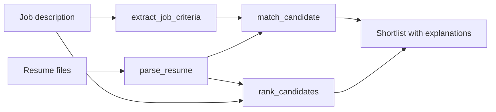

<div align="center">

<a href="https://hirelayer.co"></a>

# HireLayer MCP Server

**Resume parsing, candidate matching and candidate ranking for AI agents.**

The official [Model Context Protocol](https://modelcontextprotocol.io) server for [HireLayer](https://hirelayer.co). Parse resumes and CVs, turn job descriptions into criteria, then score and rank candidates from Claude, ChatGPT, Cursor, VS Code, Codex or any MCP client.

**Server URL: `https://hirelayer.co/mcp`** · sign in with your HireLayer account, no API key to copy.

[](https://www.npmjs.com/package/hirelayer-mcp)
[](https://github.com/hirelayer/hirelayer-mcp/actions/workflows/ci.yml)
[](LICENSE)
[](https://modelcontextprotocol.io)

[](https://cursor.com/install-mcp?name=hirelayer&config=eyJ1cmwiOiJodHRwczovL2hpcmVsYXllci5jby9tY3AifQ%3D%3D)
[](https://vscode.dev/redirect/mcp/install?name=hirelayer&config=%7B%22type%22%3A%22http%22%2C%22url%22%3A%22https%3A%2F%2Fhirelayer.co%2Fmcp%22%7D)
[](https://insiders.vscode.dev/redirect/mcp/install?name=hirelayer&config=%7B%22type%22%3A%22http%22%2C%22url%22%3A%22https%3A%2F%2Fhirelayer.co%2Fmcp%22%7D&quality=insiders)
[](https://lmstudio.ai/install-mcp?name=hirelayer&config=eyJjb21tYW5kIjoibnB4IiwiYXJncyI6WyIteSIsImhpcmVsYXllci1tY3AiXSwiZW52Ijp7IkhJUkVMQVlFUl9BUElfS0VZIjoieW91ci1hcGkta2V5In19)

</div>

> "Screen these 3 resumes against the Senior React job and tell me who to interview."
>
> Your assistant parses each CV, extracts the job criteria, scores every candidate criterion by criterion and explains the shortlist.

## Contents

- [What you can do](#what-you-can-do)
- [Quick start](#quick-start)
- [Install in your MCP client](#install-in-your-mcp-client)
- [Tools](#tools)
- [Example prompts](#example-prompts)
- [Pricing and credits](#pricing-and-credits)
- [Data and privacy](#data-and-privacy)
- [Troubleshooting](#troubleshooting)
- [FAQ](#faq)

## What you can do

- **Parse resumes and CVs.** Turn PDF, Word, image and other files into structured JSON: contact details, work experience, education, languages, skills and the full text. Scanned resumes go through OCR, and the resume language is detected.
- **Turn a job description into criteria.** Get weighted, explained matching criteria, with mandatory requirements flagged.
- **Match candidates to jobs.** Score a resume against a job from 0 to 1, with an explanation for each criterion.
- **Rank candidates.** Order up to 10 candidates for the same job in one call, with a score and a rationale for each.
- **Normalize skills.** Map free-text skills in French or English to a skills taxonomy with stable IDs.

Use it to screen applicants in a chat, build a recruiting agent, enrich an ATS, or prototype HR tech features without writing integration code.

## Quick start

1. **Add the server URL** `https://hirelayer.co/mcp` in your AI app, or click a one-click install button above.
2. **Sign in to HireLayer** when your app asks, and allow access. No account yet? [Sign up for free](https://hirelayer.co/auth/signup): 50 credits a month, no card required.
3. **Ask your assistant.** For example: attach a resume and ask *"Summarize this candidate."*

To try it without your own data, use the sample job and resumes in [`examples/`](examples). The repository ships a [`.mcp.json`](.mcp.json): clone it, export `HIRELAYER_API_KEY`, open the folder in Claude Code and it offers to enable the local server.

## Install in your MCP client

### Hosted server (recommended)

Connect to `https://hirelayer.co/mcp` and sign in to HireLayer. Nothing to install, nothing to keep up to date.

| Client | How to connect |
|---|---|
| **Claude** (web, desktop, mobile) | Settings → Connectors → **Add custom connector**, paste the URL, then **Connect** |
| **ChatGPT** | Settings → Apps → turn on developer mode, create an app with the URL and OAuth authentication |
| **Claude Code** | `claude mcp add --transport http hirelayer https://hirelayer.co/mcp`, then `/mcp` to sign in |
| **Cursor** | Click **Install in Cursor** above, or add `{ "mcpServers": { "hirelayer": { "url": "https://hirelayer.co/mcp" } } }` to `~/.cursor/mcp.json` |
| **VS Code** | Click **Install in VS Code** above, or add `{ "servers": { "hirelayer": { "type": "http", "url": "https://hirelayer.co/mcp" } } }` to `.vscode/mcp.json` |
| **Codex CLI** | `codex mcp add hirelayer --url https://hirelayer.co/mcp`, then `codex mcp login hirelayer` |

Clients that cannot sign in with OAuth can send a HireLayer API key instead: `Authorization: Bearer your-api-key`.

The hosted `parse_resume` takes a file attached in ChatGPT, a public HTTPS URL, a small file in base64 or the resume text. To parse files from your disk, run the server locally.

### Local server (npx)

Runs on your machine with an API key: [sign up](https://hirelayer.co/auth/signup), then copy your key from **Dashboard → API keys** and replace `your-api-key` below.

<details open>
<summary><b>Claude Code</b></summary>

```bash
claude mcp add hirelayer --env HIRELAYER_API_KEY=your-api-key -- npx -y hirelayer-mcp
```

</details>

<details>
<summary><b>Claude Desktop</b></summary>

Open **Settings → Developer → Edit Config** and add the server to `claude_desktop_config.json`:

```json
{
  "mcpServers": {
    "hirelayer": {
      "command": "npx",
      "args": ["-y", "hirelayer-mcp"],
      "env": { "HIRELAYER_API_KEY": "your-api-key" }
    }
  }
}
```

Restart Claude Desktop.

</details>

<details>
<summary><b>Cursor</b></summary>

Add this to `~/.cursor/mcp.json` (all projects) or `.cursor/mcp.json` (one project):

```json
{
  "mcpServers": {
    "hirelayer": {
      "command": "npx",
      "args": ["-y", "hirelayer-mcp"],
      "env": { "HIRELAYER_API_KEY": "your-api-key" }
    }
  }
}
```

</details>

<details>
<summary><b>VS Code (GitHub Copilot)</b></summary>

Add this to `.vscode/mcp.json`. VS Code asks for your API key and stores it securely:

```json
{
  "inputs": [
    { "type": "promptString", "id": "hirelayer_api_key", "description": "HireLayer API key", "password": true }
  ],
  "servers": {
    "hirelayer": {
      "type": "stdio",
      "command": "npx",
      "args": ["-y", "hirelayer-mcp"],
      "env": { "HIRELAYER_API_KEY": "${input:hirelayer_api_key}" }
    }
  }
}
```

</details>

<details>
<summary><b>Windsurf</b></summary>

Add this to `~/.codeium/windsurf/mcp_config.json`:

```json
{
  "mcpServers": {
    "hirelayer": {
      "command": "npx",
      "args": ["-y", "hirelayer-mcp"],
      "env": { "HIRELAYER_API_KEY": "your-api-key" }
    }
  }
}
```

</details>

<details>
<summary><b>OpenAI Codex CLI</b></summary>

```bash
codex mcp add hirelayer --env HIRELAYER_API_KEY=your-api-key -- npx -y hirelayer-mcp
```

</details>

<details>
<summary><b>Gemini CLI</b></summary>

```bash
gemini mcp add -e HIRELAYER_API_KEY=your-api-key hirelayer npx -y hirelayer-mcp
```

</details>

<details>
<summary><b>Cline, Roo Code, Zed, LM Studio and other clients</b></summary>

Any client that runs stdio MCP servers works with this command and environment variable:

- Command: `npx -y hirelayer-mcp`
- Environment: `HIRELAYER_API_KEY=your-api-key`

Cline users can also ask Cline to install the server: [`llms-install.md`](llms-install.md) has the steps.

</details>

<details>
<summary><b>Docker</b></summary>

```bash
docker build -t hirelayer-mcp .
docker run -i --rm -e HIRELAYER_API_KEY=your-api-key hirelayer-mcp
```

In Docker, `parse_resume` only reads files that you mount into the container. Otherwise, pass `file_url`.

</details>

## Tools

| Tool | What it does | Typical input |
|---|---|---|
| `parse_resume` | Parses a resume or CV file into structured JSON: contact details, experience, education, languages, skills and the full text | A local `file_path` or a public `file_url`. Accepts PDF, DOC, DOCX, ODT, RTF, TXT, PPT, PPTX, ODP, XLS, JPG, PNG or BMP files under 4.5 MB. |
| `extract_job_criteria` | Turns a job description into weighted criteria: a weight from 1 to 3, a mandatory flag and a rationale for each | Job description text |
| `match_candidate` | Scores one candidate against a job from 0 to 1, with a summary and a status and explanation for each criterion | Job text, resume text and criteria |
| `rank_candidates` | Ranks up to 10 candidates for one job, with a score and a rationale for each | Job text and up to 10 resume texts |
| `resolve_skills` | Maps free-text skills in French or English to taxonomy skills, with their families and domains | Free text, from one skill to a whole skills section |

All tools only read and analyse data. They never change anything in your systems.

The server also ships **prompts** that clients show as ready-made commands:

| Prompt | What it does |
|---|---|
| `screen_candidates` | Runs the full screening workflow (criteria, parsing, matching) and writes a shortlist |
| `summarize_resume` | Parses one resume and writes a recruiter summary |
| `normalize_skills` | Normalizes a skills section and groups it by domain |

### How screening works



<details>
<summary><b>Example output from <code>match_candidate</code></b></summary>

```json
{
  "score": 0.89,
  "summary": "Profil très aligné : React, TypeScript et l’expérience demandée sont démontrés. Le niveau d’anglais reste à confirmer.",
  "evaluated_criteria": [
    {
      "id": "crit_1",
      "label": "Maîtrise de React",
      "weight": 3,
      "is_mandatory": true,
      "match_status": "ideal",
      "match_explanation": "Le CV décrit une équipe React dirigée depuis 2022 sur une plateforme en production."
    }
  ]
}
```

Criteria labels, rationales, summaries and explanations are written in French. Your assistant translates them when it answers you in another language.

</details>

## Example prompts

**Recruiters and hiring managers**

- "Parse `~/Downloads/jane-doe.pdf` and summarize her experience in five bullet points."
- "Here is our job description for a Senior Data Engineer. Extract the criteria, then tell me which ones are must-haves."
- "Score the resumes in `~/candidates/` against this job and give me a shortlist table with scores and main gaps."
- "Rank these 8 candidates for the Account Executive role and explain why the top 3 stand out."
- "Does this candidate meet every mandatory criterion? If not, which ones are missing?"

**Developers and HR tech teams**

- "Parse this resume and map the result to our ATS candidate schema: `{ name, email, current_title, skills[] }`."
- "Normalize this skills section: Pack Office (Word, Excel), React.js, anglais courant, gestion de projet."
- "Write a TypeScript function that sends a resume to the HireLayer API, using the JSON this tool returned as the expected type."

**Try it now with the sample files**

- "Screen the resumes in `examples/` against `examples/job-senior-react-developer.md`."

## Pricing and credits

Each successful tool call costs **1 HireLayer credit**. A `rank_candidates` call costs 1 credit whatever the number of candidates. Failed calls are not charged.

| Plan | Credits | Price |
|---|---|---|
| Free | 50 a month | Free, no card required |
| Paid plans | More credits and higher limits | See [hirelayer.co/#pricing](https://hirelayer.co/#pricing) |

## Data and privacy

- The hosted server receives only what your assistant sends to HireLayer tools. Each app gets access only after you sign in and allow it, and you can disconnect it at any time.
- The local server runs **on your machine** and calls the HireLayer API over HTTPS with your API key. It has no telemetry.
- `parse_resume` reads only the file you name. By default HireLayer stores the original file and returns a link to it in `info_resume.url`. Set `do_not_store_data: true` in a call so the file is not stored.
- See the [privacy policy](https://hirelayer.co/privacy-policy) and the [security policy](SECURITY.md).

Resumes contain personal data. Use the tools in line with your hiring process and the rules that apply to you, such as GDPR. Scores support human decisions; they don't replace them.

## Configuration

| Variable | Required | Default | Description |
|---|---|---|---|
| `HIRELAYER_API_KEY` | Yes | | Your HireLayer API key |
| `HIRELAYER_BASE_URL` | No | `https://hirelayer.co` | API base URL, for testing |

## Troubleshooting

| Symptom | Fix |
|---|---|
| `HIRELAYER_API_KEY is not set` | Add the `env` block with your key to the client config, then restart the client. |
| `HireLayer API returned 401` | The key is wrong or revoked. Copy it again from **Dashboard → API keys**. |
| `HireLayer API returned 403` | You have used your monthly credits. Wait for the reset or upgrade your plan. |
| Parsing seems slow | Parsing usually takes about 35 seconds, and longer for scans that need OCR. The server sends progress updates so clients don't time out. |
| `npx` not found or an old Node.js | Install Node.js 20 or later from [nodejs.org](https://nodejs.org). |
| The file is not found | Use an absolute path, for example `/Users/me/Downloads/cv.pdf` rather than `~/Downloads/cv.pdf`. |

To debug, run the server in the MCP Inspector:

```bash
HIRELAYER_API_KEY=your-api-key npx @modelcontextprotocol/inspector npx -y hirelayer-mcp
```

## FAQ

**Is HireLayer an ATS?**
No. HireLayer provides the AI building blocks of recruiting software: resume parsing, matching, ranking and skills. Use them on their own through MCP, or plug them into your ATS or HR tech product through the [REST API](https://hirelayer.co/api-docs).

**Which language are the results in?**
The text that HireLayer writes (criteria labels and rationales, match summaries and explanations, ranking rationales) is in French; your assistant translates it when it answers in another language. Skills resolution returns French or English labels.

**Which resume languages are supported?**
The parser detects the main language of each resume and returns it in `info_resume.language`.

**Can I use the REST API directly?**
Yes. See the [API reference](https://hirelayer.co/api-docs), the [OpenAPI spec](https://hirelayer.co/openapi.json) and [`llms.txt`](https://hirelayer.co/llms.txt) for agents.

**Do I need an API key?**
Not with the hosted server: you sign in to HireLayer and allow access, and the app's calls use your plan's credits. Each connected app appears as an "(MCP)" key in **Dashboard → API keys**; revoke it to disconnect the app. The local server uses an API key.

## Development

```bash
git clone https://github.com/hirelayer/hirelayer-mcp.git
cd hirelayer-mcp
npm install
npm test
HIRELAYER_API_KEY=your-api-key npx @modelcontextprotocol/inspector node dist/index.js
```

See [CONTRIBUTING.md](CONTRIBUTING.md). Report bugs in [GitHub issues](https://github.com/hirelayer/hirelayer-mcp/issues) and vulnerabilities as described in [SECURITY.md](SECURITY.md).

## Links

- Website: [hirelayer.co](https://hirelayer.co)
- API reference: [hirelayer.co/api-docs](https://hirelayer.co/api-docs)
- OpenAPI: [hirelayer.co/openapi.json](https://hirelayer.co/openapi.json)
- Docs for agents: [hirelayer.co/llms.txt](https://hirelayer.co/llms.txt)
- Contact: [contact@hirelayer.co](mailto:contact@hirelayer.co)

## License

[MIT](LICENSE)
